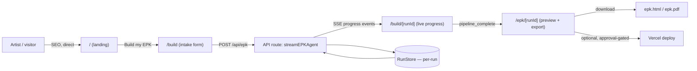

# ArtistEPKs — Front-End Build Plan

Compressed POP output (Intent Brief → NPAO phasing → v1 scope → architecture). Full
14-section ceremony skipped on purpose — Pat's own stated preference is smallest
shippable v1 this week over six months of planning docs. This file is the plan of
record; update it in place as scope changes instead of spawning new plan docs.

## 1. Intent Brief

Ship a working, good-looking front end — under the **ArtistEPKs** brand — on top of
the EPK generation backend that already exists in this repo, so an independent
artist can land on the site, build a real press kit, and walk away with a
downloadable/deployable EPK. No accounts, dashboard, directory, or CRM in v1 — those
are real features, deliberately deferred (see §5).

## 2. Where this sits vs. what already exists

- **Brand:** ArtistEPKs (held domain, per Pat's portfolio) — NOT "ROSTR EPK Agent,"
  which is this repo's internal backend/plugin name. The `/api/epk` and `/api/mcp`
  routes, and everything in `src/agent/`, stay as-is — they're the engine, not the brand.
- **Backend (done, this session):** intake → master.md → discography → social/
  engagement score → press analysis → music theme analysis → design-system resolution
  → bio generation → render (HTML/PDF/Reveal.js/PPTX/Presenton). Verified with real
  test runs; LLM-backed steps degrade gracefully without a key.
- **Front end (does not exist yet):** `src/app/page.tsx` is a marketing page for the
  *GitHub repo*, not a product. No intake UI, no preview, no export flow, no auth,
  no dashboard. This plan is for that gap only.
- **Stack change:** current pages use hand-rolled inline `style={{}}` objects. Moving
  to **Tailwind + shadcn/ui**, matching Pat's stated default stack, and to give a real
  component system to build the intake flow and preview on top of.

## 3. v1 scope — ship this

| Route | Purpose |
|---|---|
| `/` | Marketing/landing page. SEO entry point. |
| `/build` | Intake flow — the EPKIntake fields, template picker. |
| `/build/[runId]` | Live generation progress (SSE from `/api/epk`), step-by-step. |
| `/epk/[runId]` | Final EPK preview + export (download HTML/PDF, optional Vercel deploy). |

**Explicitly OUT of v1** (real, just not this slice): accounts/auth, "My EPKs"
dashboard, Profile, Knowledge Base upload, artist Directory, Inbox/Campaigns/CRM.
Building these now, before one artist has used the core flow once, is the scope-creep
failure mode — ship the loop that proves the product first.

## 4. NPAO phasing

- **D1 — Design (N/A tasks):** brand system (palette/type/logo mark), sitemap, the
  4 v1 screens above, component inventory.
- **D2 — Develop (P tasks):** build the 4 routes against the existing `/api/epk` SSE
  stream and `EPKIntake` type; Tailwind + shadcn/ui component set.
- **D3 — Deploy (P/O tasks):** Vercel deploy, SEO metadata/OG tags/sitemap.xml/
  robots.txt, structured data for the landing page.
- **D4 — Debug/QA (O tasks):** responsive pass, run the app end-to-end with the `run`
  skill, accessibility check on the intake form.

## 5. Architecture (v1 slice only)

## 6. Next steps

1. `webpage-designer` → design `/` (landing) section-by-section: hero, how-it-works,
   template gallery, social proof placeholder, CTA. SEO-driven copy and structure.
2. `saas-architect` → architect + build `/build`, `/build/[runId]`, `/epk/[runId]`
   against the existing API, with Tailwind + shadcn/ui.
3. Wire Tailwind into this repo (not currently installed).
4. Build all 4 routes as real Next.js pages/components.
5. `run` skill to actually launch and click through it before calling this done.
